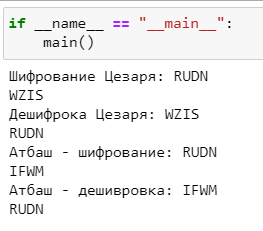

---
# Front matter
title: "Отчёт по лабораторной работе №1"
subtitle: "Шифр простой замены"
author: "Бакундукизе Эжид Принц НФИмд-01-21"

# Generic otions
lang: ru-RU
toc-title: "Содержание"

# Bibliography
bibliography: bib/cite.bib
csl: pandoc/csl/gost-r-7-0-5-2008-numeric.csl

# Pdf output format
toc: true # Table of contents
toc_depth: 2
lof: true # List of figures
fontsize: 12pt
linestretch: 1.5
papersize: a4
documentclass: scrreprt
## I18n
polyglossia-lang:
  name: russian
  options:
	- spelling=modern
	- babelshorthands=true
polyglossia-otherlangs:
  name: english
### Fonts
mainfont: PT Serif
romanfont: PT Serif
sansfont: PT Sans
monofont: PT Mono
mainfontoptions: Ligatures=TeX
romanfontoptions: Ligatures=TeX
sansfontoptions: Ligatures=TeX,Scale=MatchLowercase
monofontoptions: Scale=MatchLowercase,Scale=0.9
## Biblatex
biblatex: true
biblio-style: "gost-numeric"
biblatexoptions:
  - parentracker=true
  - backend=biber
  - hyperref=auto
  - language=auto
  - autolang=other*
  - citestyle=gost-numeric
## Misc options
indent: true
header-includes:
  - \linepenalty=10 # the penalty added to the badness of each line within a paragraph (no associated penalty node) Increasing the value makes tex try to have fewer lines in the paragraph.
  - \interlinepenalty=0 # value of the penalty (node) added after each line of a paragraph.
  - \hyphenpenalty=50 # the penalty for line breaking at an automatically inserted hyphen
  - \exhyphenpenalty=50 # the penalty for line breaking at an explicit hyphen
  - \binoppenalty=700 # the penalty for breaking a line at a binary operator
  - \relpenalty=500 # the penalty for breaking a line at a relation
  - \clubpenalty=150 # extra penalty for breaking after first line of a paragraph
  - \widowpenalty=150 # extra penalty for breaking before last line of a paragraph
  - \displaywidowpenalty=50 # extra penalty for breaking before last line before a display math
  - \brokenpenalty=100 # extra penalty for page breaking after a hyphenated line
  - \predisplaypenalty=10000 # penalty for breaking before a display
  - \postdisplaypenalty=0 # penalty for breaking after a display
  - \floatingpenalty = 20000 # penalty for splitting an insertion (can only be split footnote in standard LaTeX)
  - \raggedbottom # or \flushbottom
  - \usepackage{float} # keep figures where there are in the text
  - \floatplacement{figure}{H} # keep figures where there are in the text
---

# Цель работы

Изучение алгоритмов шифрования Цезаря и Атбаш

# Теоретические сведения

## Шифр Цезаря


Шифр Цезаря — один из древнейших шифров. При шифровании каждый символ заменяется другим, отстоящим от него в алфавите на фиксированное число позиций. Шифр Цезаря можно классифицировать как шифр подстановки, при более узкой классификации — шифр простой замены [1]. Например, в шифре со сдвигом 3 А была бы заменена на Г, Б станет Д, и так далее.


Шаг шифрования, выполняемый шифром Цезаря, часто включается как часть более сложных схем, таких как шифр Виженера, и все ещё имеет современное приложение в системе ROT13. Как и все моноалфавитные шифры, шифр Цезаря легко взламывается и не имеет практически никакого применения на практике.

Если сопоставить каждому символу алфавита его порядковый номер (нумеруя с 0), то шифрование и дешифрование можно выразить формулами модульной арифметики [2]:

```
y = (x + k) mod n
x = (y - k + n) mod n
```

где
*x — символ открытого текста,
*y — символ шифрованного текста
*n — мощность алфавита
*k — ключ.


## Шифр Атбаш

Шифр Атбаша является шифром сдвига на всю длину алфавита. Правило шифрования состоит в замене i-й буквы алфавита буквой с номером n − i + 1, где n — число букв в алфавите. Также, как и Шифрование Цезаря является методом простой замены [3]. 

# Выполнение работы

## Реализация шифра Цезаря на языке Python

Блок шифрования

```
# функция шифрования по алгоритму цезаря
def tsesar():
    # Объявляем алфавит
    letters = 'ABCDEFGHIJKLMNOPQRSTUVWXYZABCDEFGHIJKLMNOPQRSTUVWXYZ'
    # Задаем шаг в шифровке - на сколько шагов сделать ход по алфавиту.
    step = 5
    # Ввод строки для шифрования
    text = input("Шифрование Цезаря: ")
    #Переменная для результата
    result = ''
    # Шифрование
    for i in text:
        ind = letters.find(i)    # Вычисляем места символов в списке
        newind = ind + step    # Сдвигаем символы на указанный в переменной step шаг
        if i in letters:
            result += letters[newind]  # Задаем значения в итог
        else:
            result += i
    print(result)
```

Блок дешифровки

```
# Дешифрование: вместо добавления шага, вычитаем его и получаем исходное сообщение
def tsesar_deshifr():
    letters = 'ABCDEFGHIJKLMNOPQRSTUVWXYZABCDEFGHIJKLMNOPQRSTUVWXYZ'
    smeshenie = 5
    text = input("Дешифрока Цезаря: ")
    result = ''

    for i in text:
        ind = letters.find(i)
        newind = ind - smeshenie
        if i in letters:
            result += letters[newind]
        else:
            result += i
    print(result)
```

## Реализация шифра Атбаш на языке Python

Блок шифрования

```
# шифр атбаша заключается тупо в том, что меняются буквы 
# из обычного алфавита на буквы из алфавита-наоборот
#вместо А идет Z и тп
def atbash():
    # задаем алфавит
    letters = [chr(x) for x in range(65, 91)]
    # алфавит-наоборот
    letters_r = [x for x in letters]
    letters_r.reverse()

    text = input("Атбаш - шифрование")
    result = ""
    # тут для перебираются буквы из исходного текста
    for i in text:
        # перебираются индексы и значения из letters
        for j,l in enumerate(letters):
            if i == l: # если буквы i и l равны, то
                result += letters_r[j] 
		# ставим в результат букву из реверсированного списка с индексом j
    print(result)
```

Блок дешифровки

```
# Дешефровка: меняем местами списки алфавита
def atbash_desh():
    letters = [chr(x) for x in range(65, 91)]
    letters_r = [x for x in letters]
    letters_r.reverse()

    text = input("Атбаш - дешивровка: ")
    result = ""
    for i in text:
        for j, l in enumerate(letters_r):
            if i == l:
                result += letters[j]
    print(result)
```

## Работа алгоритмов

{ #fig:001 width=70% height=70%}

# Выводы

В ходе выполнения данной лабораторной работы мы познакомились с алгортмами шифрования простой замены. 

Рассмотрели данный вид алгоритмов на примере шифрования Цезаря и Атбаш. Выполнили программную реализацию этих двух алгоритмов.

# Список литературы{.unnumbered}

1. [Роберт Черчхаус, "Коды и шифры. Юлий Цезарь"]
2. [Гай Светоний Транквилл. Жизнь двенадцати цезарей]
3. [Атбаш (https://www.livelib.ru/book/1001019648-atbash)]
