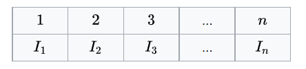
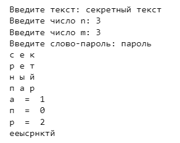
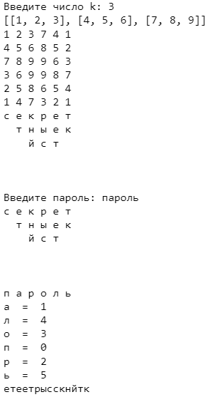

---
## Front matter
lang: ru-RU
title: Шифры перестановки
author: Бакундукизе Эжид Принц НФИмд-01-21
institute: Российский Университет Дружбы Народов
date: 21 сентября, 2022, Москва, Россия

## Formatting
mainfont: PT Serif
romanfont: PT Serif
sansfont: PT Sans
monofont: PT Mono
toc: false
slide_level: 2
theme: metropolis
header-includes: 
 - \metroset{progressbar=frametitle,sectionpage=progressbar,numbering=fraction}
 - '\makeatletter'
 - '\beamer@ignorenonframefalse'
 - '\makeatother'
aspectratio: 43
section-titles: true

---

# Цели и задачи

## Цель лабораторной работы

Изучение алгоритмов шифров перестановки: маршрутное шифрование, шифрование с помощью решеток и таблица Виженера 

# Выполнение лабораторной работы

## Шифры перестановки

Шифр перестано́вки — это метод симметричного шифрования, в котором элементы исходного открытого текста меняют местами. Элементами текста могут быть отдельные символы (самый распространённый случай), пары букв, тройки букв, комбинирование этих случаев и так далее. 
Как правило, при шифровании и дешифровании шифра простой перестановки используется таблица перестановок:
{ #fig:001 width=70% height=70%}

## Маршрутное шифрование

Простейшим примеров перестановочного шифра являются так называемые «маршрутные перестановки», использующие некоторую геометрическую фигуру (плоскую или объемную). Шифрование заключается в том, что текст записывается в такую фигуру по некоторой траектории, а выписывается по другой траектории. Шифруемое сообщение в этом случае записывается в прямоугольную таблицу по маршруту: по горизонтали, начиная с верхнего левого угла, поочередно слева направо. 

## Контрольный пример

{ #fig:002 width=70% height=70%}

## Шифрование с помощью решеток

Решётка Кардано — инструмент кодирования и декодирования, представляющий собой специальную прямоугольную (в частном случае — квадратную) таблицу-карточку, четверть ячеек которой вырезана.
Таблица накладывается на носитель, и в вырезанные ячейки вписываются буквы, составляющие сообщение. После переворачивания таблицы вдоль вертикальной оси, процесс вписывания букв повторяется. Затем то же самое происходит после переворачивания вдоль горизонтальной и снова вдоль вертикальной осей.

## Контрольный пример

{ #fig:003 width=70% height=70%}

## Шифр Виженера

Шифр Виженера — метод полиалфавитного шифрования буквенного текста с использованием ключевого слова.
Шифр Виженера состоит из последовательности нескольких шифров Цезаря с различными значениями сдвига. Применительно к латинскому алфавиту таблица Виженера составляется из строк по 26 символов, причём каждая следующая строка сдвигается на несколько позиций. Таким образом, в таблице получается 26 различных шифров Цезаря. На каждом этапе шифрования используются различные алфавиты, выбираемые в зависимости от символа ключевого слова.

## Контрольный пример

{ #fig:004 width=70% height=70%}

# Выводы

## Результаты выполнения лабораторной работы

В ходе выполнения данной лабораторной работы мы изучили алгоритмы шифров перестановки: маршрутное шифрование, шифрование с помощью решеток и таблица Виженер. Реализовали данные методы шифрования программно и продемонстрировали результат.