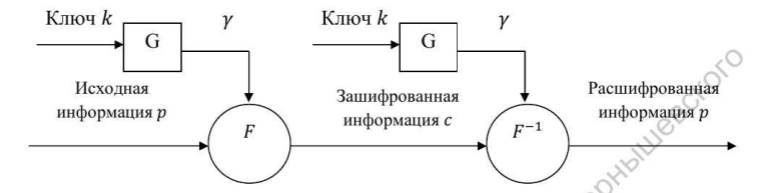
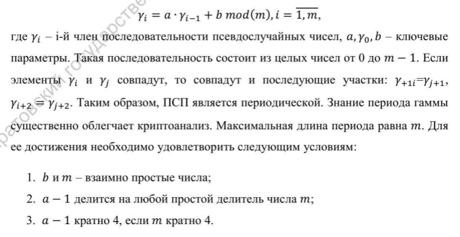
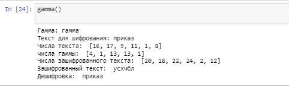

---
## Front matter
lang: ru-RU
title: Шифр гаммирования
author: Бакундукизе Эжид Принц НФИмд-01-21
institute: Российский Университет Дружбы Народов
date: 21 сентября, 2022, Москва, Россия

## Formatting
mainfont: PT Serif
romanfont: PT Serif
sansfont: PT Sans
monofont: PT Mono
toc: false
slide_level: 2
theme: metropolis
header-includes: 
 - \metroset{progressbar=frametitle,sectionpage=progressbar,numbering=fraction}
 - '\makeatletter'
 - '\beamer@ignorenonframefalse'
 - '\makeatother'
aspectratio: 43
section-titles: true

---

# Цели и задачи

## Цель лабораторной работы

Изучение алгоритма шифрования гаммированием

# Выполнение лабораторной работы

## Гаммирование

Гаммирование — метод симметричного шифрования, заключающийся в «наложении» последовательности, состоящей из случайных чисел, на открытый текст. Последовательность случайных чисел называется гамма-последовательностью и используется для зашифровывания и расшифровывания данных

## Схема шифрования гаммированием

{ #fig:001 }

## Простейший генератор пседвослучайной последовательности

{ #fig:002 }

## Стойкость алгоритма

Стойкость шифров зависит от характеристик гаммы - длины и равномерности распределения вероятностей появления знаков гаммы. При использовании генератора псевдослучайных последовательностей получаем бесконечную гамму.  
Метод гаммирования становится бессильным, если известен фрагмент исходного текста и соответствующая ему шифрограмма. В этом случае простым вычитанием по модулю 2 получается отрезок псевдослучайной последовательности и по нему восстанавливается вся эта последовательность.

## Пример работы алгоритма

{ #fig:003 width=70% height=70%}

# Выводы

## Результаты выполнения лабораторной работы

Изучили алгоритм шифрования с помощью гаммирования