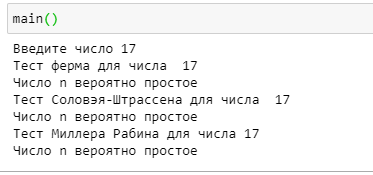

---
## Front matter
lang: ru-RU
title: Вероятностные алгоритмы проверки чисел на простоту
author: Бакундукизе Эжид Принц НФИмд-01-21
institute: Российский Университет Дружбы Народов
date: 21 сентября, 2022, Москва, Россия

## Formatting
mainfont: PT Serif
romanfont: PT Serif
sansfont: PT Sans
monofont: PT Mono
toc: false
slide_level: 2
theme: metropolis
header-includes: 
 - \metroset{progressbar=frametitle,sectionpage=progressbar,numbering=fraction}
 - '\makeatletter'
 - '\beamer@ignorenonframefalse'
 - '\makeatother'
aspectratio: 43
section-titles: true

---

# Цели и задачи

## Цель лабораторной работы

Изучение алгоритов Ферма, Соловэя-Штрассена, Миллера-Рабина.

# Выполнение лабораторной работы

## Простыре числа

Для построения многих систем защиты информации требуются простые числа большой разрядности.

Существует два типа критериев простоты: детерминированные и вероятностные. 

Детерминированные тесты полезны, когда необходимо построить большое простое число.
Вероятностные тесты можно эффективно использовать для тестирования отдельных чисел, однако их результаты, с некоторой вероятностью, могут быть неверными. К счастью, ценой количества повторений теста с модифицированными исходными данными вероятность ошибки можно сделать как угодно малой.

## Тест Ферма

* Вход. Нечетное целое число $n \geq 5$.
* Выход. «Число n, вероятно, простое» или «Число n составное».

1. Выбрать случайное целое число $a, 2 \leq a \leq n-2$.
2. Вычислить $r=a^{n-1} (mod n)$
3. При $r=1$ результат: «Число n, вероятно, простое». В противном случае результат: «Число n составное»..

## Тест Соловэя-Штрассена

* Вход. Нечетное целое число $n \geq 5$.
* Выход. «Число n, вероятно, простое» или «Число n составное».

1. Выбрать случайное целое число $a, 2 \leq a \leq n-2$.
2. Вычислить $r=a^{(\frac{n-1}{2})} (mod n)$
3. При $r \neq 1$ и $r \neq n-1$ результат: «Число n составное».
4. Вычислить символ Якоби $s = (\frac{a}{n})$
5. При $r=s (mod n)$ результат: «Число n, вероятно, простое». В противном случае результат: «Число n составное».

## Тест Миллера-Рабина.

1. Представить $n-1$ в виде $n-1 = 2^sr$, где r - нечетное число
2. Выбрать случайное целое число $a, 2 \leq a \leq n-2$.
3. Вычислить $y=a^r (mod n)$
4. При $y \neq 1$ и $y \neq n-1$ выполнить действия
	- Положить $j=1$
	- Если $j \leq s-1$ и $y \neq n-1$ то
		* Положить $y=y^2 (mod n)$
		* При $y=1$   результат: «Число n составное».
		* Положить $j=j+1$
	- При $y \neq n-1$ результат: «Число n составное».
5. Результат: «Число n, вероятно, простое».

## Пример работы алгоритма

{ #fig:001 }

# Выводы

## Результаты выполнения лабораторной работы

В ходе выполнения данной лабораторной работы мы изучили вероятностные алгоритмы проверки чисел на простоту, в частности, были рассмотрены алгоритмы Ферма, Соловэя-Штрассена и Миллера-Рабина. Перечисленные алгоритмы были реализованы программно, представлены результаты работы алгоритмов. 