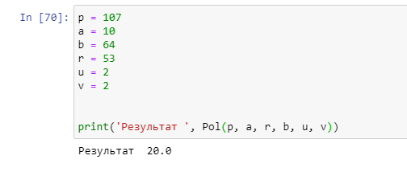

---
# Front matter
title: "Отчёт по лабораторной работе №7"
subtitle: "Дискретное логарифмирование"
author: "Бакундукизе Эжид Принц НФИмд-01-21"

# Generic otions
lang: ru-RU
toc-title: "Содержание"

# Bibliography
bibliography: bib/cite.bib
csl: pandoc/csl/gost-r-7-0-5-2008-numeric.csl

# Pdf output format
toc: true # Table of contents
toc_depth: 2
lof: true # List of figures
fontsize: 12pt
linestretch: 1.5
papersize: a4
documentclass: scrreprt
## I18n
polyglossia-lang:
  name: russian
  options:
	- spelling=modern
	- babelshorthands=true
polyglossia-otherlangs:
  name: english
### Fonts
mainfont: PT Serif
romanfont: PT Serif
sansfont: PT Sans
monofont: PT Mono
mainfontoptions: Ligatures=TeX
romanfontoptions: Ligatures=TeX
sansfontoptions: Ligatures=TeX,Scale=MatchLowercase
monofontoptions: Scale=MatchLowercase,Scale=0.9
## Biblatex
biblatex: true
biblio-style: "gost-numeric"
biblatexoptions:
  - parentracker=true
  - backend=biber
  - hyperref=auto
  - language=auto
  - autolang=other*
  - citestyle=gost-numeric
## Misc options
indent: true
header-includes:
  - \linepenalty=10 # the penalty added to the badness of each line within a paragraph (no associated penalty node) Increasing the value makes tex try to have fewer lines in the paragraph.
  - \interlinepenalty=0 # value of the penalty (node) added after each line of a paragraph.
  - \hyphenpenalty=50 # the penalty for line breaking at an automatically inserted hyphen
  - \exhyphenpenalty=50 # the penalty for line breaking at an explicit hyphen
  - \binoppenalty=700 # the penalty for breaking a line at a binary operator
  - \relpenalty=500 # the penalty for breaking a line at a relation
  - \clubpenalty=150 # extra penalty for breaking after first line of a paragraph
  - \widowpenalty=150 # extra penalty for breaking before last line of a paragraph
  - \displaywidowpenalty=50 # extra penalty for breaking before last line before a display math
  - \brokenpenalty=100 # extra penalty for page breaking after a hyphenated line
  - \predisplaypenalty=10000 # penalty for breaking before a display
  - \postdisplaypenalty=0 # penalty for breaking after a display
  - \floatingpenalty = 20000 # penalty for splitting an insertion (can only be split footnote in standard LaTeX)
  - \raggedbottom # or \flushbottom
  - \usepackage{float} # keep figures where there are in the text
  - \floatplacement{figure}{H} # keep figures where there are in the text
---

# Цель работы

Изучение задачи дискретного логарифмирования.

# Теоретические сведения

Пусть в некоторой конечной мультипликативной абелевой группе $G$ задано уравнение

$$g^x=a$$

Решение задачи дискретного логарифмирования состоит в нахождении некоторого целого неотрицательного числа $x$, удовлетворяющего уравнению. Если оно разрешимо, у него должно быть хотя бы одно натуральное решение, не превышающее порядок группы [1].
Это сразу даёт грубую оценку сложности алгоритма поиска решений сверху — алгоритм полного перебора нашёл бы решение за число шагов не выше порядка данной группы.

Чаще всего рассматривается случай, когда группа является циклической, порождённой элементом $g$.
В этом случае уравнение всегда имеет решение. 
В случае же произвольной группы вопрос о разрешимости задачи дискретного логарифмирования, то есть вопрос о существовании решений уравнения , требует отдельного рассмотрения.

## p-алгоритм Полларда

* Вход. Простое число $p$, число $a$ порядка $r$ по модулю $p$, целое число $b$б $1 < b < p$; отображение $f$, обладающее сжимающими свойствами и сохраняющее вычислимость логарифма.
* Выход. показатель $x$, для которого $a^x=b(mod p)$, если такой показатель существует.

1. Выбрать произвольные целые числа $u, v$ и положить $c=a^u b^v (mod p), d=c$
2. Выполнять $c=f(c)(mod p), d=f(f(d))(mod p), вычисляя при этом логарифмы для $c$ и $d$ как линейные функции от $x$ по модулю $r$, до получения равенства $c=d (mod p)$
3. Приняв логарифмы для $c$ и $d$, вычислить логарифм $x$ решением сравнения по модулю $r$. Результат $x$ или РЕШЕНИЯ НЕТ.

# Выполнение работы

## Реализация алгоритма на языке Python

```
# p - простое число (107)
# a - число порядка r по модулю p (число a=10 порядка  r = 53 по модулю p=107)
# b - целое число от 1 до p = 107
# f - отображение, обаладающее сжимающими св-вами и сохраняющее вычислимость логарифмов 


def f(p, a, b, x, u, v):
    if x < 53:
        return pow(a*x,1,p), u+1, v
    else:
        return pow(b*x,1,p), u, v+1
    
    
def ext_Euc(a, b):
    rp = a
    rc = b
    xp, xc = 1, 0
    yp, yc = 0, 1
    rn = rp % rc
    d = rc
    while rn != 0:
        rn = rp % rc
        q = (rp - rn)/rc
        d, x, y = rc, xc, yc
        
        rp = rc
        rc = rn
        
        xc = xp - q*xc
        xp = x
        
        yc = yp - q*yc
        yp = y
    
    return d, x, y


def Pol(p, a, r, b, u, v):
    c = pow(a**u * b**v,1,p)
    d = c
    uc, vc = u, v
    ud, vd = u, v
    
    c, uc, vc = f(p, a, b, c, uc, vc)
    c %= p
    d, ud, vd = f(p, a, b, *f(p, a, b, d, ud, vd))
    d %= p
    
    while c%p != d%p:
        c, uc, vc = f(p, a, b, c, uc, vc)
        c %= p
        d, ud, vd = f(p, a, b, *f(p, a, b, d, ud, vd))
        d %= p
        
    v = vc - vd
    u = ud - uc
    
    d, x, y = ext_Euc(v, r)
    
    while d != 1:
        v /= d
        u /= d
        r /= d
        d, x, y = ext_Euc(v, r)
    
    return x*u % r
```

## Контрольный пример

{ #fig:001 }

# Выводы

В ходе выполнения данной лабораторной работы мы познакомились с дискретным логарифмированием в конечном поле, программно реализовали алгоритм Полларда. 

# Список литературы{.unnumbered}

1. [Дискретное логарифмирование](https://e-maxx.ru/algo/discrete_log#:~:text=Дискретное%20логарифмирование.%20Задача%20дискретного%20логарифмирования,модифицировать%2C%20чтобы%20он%20по-прежнему%20работал))
2. [Доступно о криптографии на эллиптических кривых](https://habr.com/ru/post/335906/)